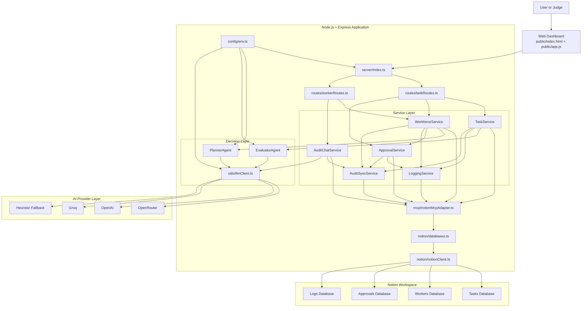
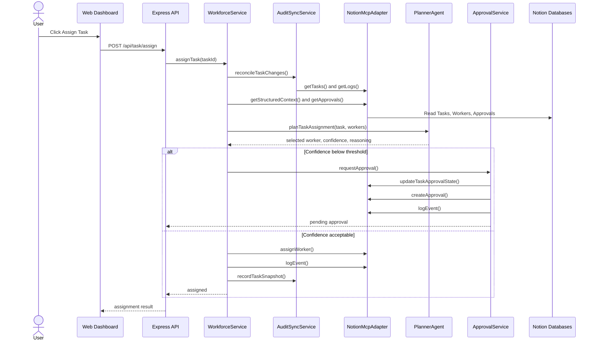

# Global Human Workforce Orchestrator

Global Human Workforce Orchestrator is a Notion hackathon project that uses AI and Notion to manage task assignment for a distributed human workforce.

It helps teams create tasks, match them with the right worker, send low-confidence decisions for human approval, and keep the full workflow visible in one dashboard.

## Problem

Managing tasks across a global team is slow when assignment, approvals, and tracking happen in different places.

## Solution

This project turns Notion into a control center where:

- tasks are created and tracked
- AI recommends the best worker
- risky assignments go to human approval
- logs stay visible for transparency and review

## Key Features

- AI-assisted worker matching based on skill, availability, and confidence
- Human-in-the-loop approval flow for uncertain assignments
- Notion-based task, worker, approval, and log management
- Live dashboard for tasks, workers, approvals, and audit history
- Audit chat to ask questions about recent activity

## Tech Stack

- Node.js
- Express
- TypeScript
- Notion API
- OpenAI-compatible LLM support
- HTML, CSS, and JavaScript frontend

## System Architecture



## Assignment Flow



## Architecture Breakdown

- `public/`: hackathon dashboard for creating tasks, assigning work, approving decisions, completing tasks, and chatting with the audit trail.
- `server/index.ts`: Express bootstrap that wires routes, services, agents, static frontend, and API endpoints.
- `routes/taskRoutes.ts`: task creation, assignment, approval, and completion endpoints.
- `routes/workerRoutes.ts`: dashboard, workers, tasks, approvals, logs, workspace snapshot, and audit chat endpoints.
- `services/workforceService.ts`: main orchestration logic for worker selection, dashboard state, approvals, and workspace snapshots.
- `services/taskService.ts`: task creation, completion, evaluation, logging, and snapshot recording.
- `services/approvalService.ts`: human approval workflow, approval resolution, reassignment, and task status updates.
- `services/auditSyncService.ts`: detects manual Notion edits by comparing task snapshots and writes audit events.
- `services/auditChatService.ts`: answers questions about recent tasks, workers, approvals, and logs.
- `services/loggingService.ts`: central event logging into the Notion Logs database.
- `agents/plannerAgent.ts`: ranks workers using skill, availability, timezone, and cost scoring.
- `agents/evaluatorAgent.ts`: scores completed work and flags tasks that need human review.
- `utils/llmClient.ts`: optional model narration layer with `openrouter`, `openai`, `groq`, `compatible`, `local`, or heuristic fallback.
- `mcp/notionMcpAdapter.ts`: unified interface between the service layer and Notion operations.
- `notion/databases.ts`: schema-tolerant read and write logic for all Notion databases.
- `notion/notionClient.ts`: shared Notion SDK client.
- `config/env.ts`: environment loading and runtime configuration.

## Data Stored In Notion

The project uses four Notion databases:

- `Tasks`: task details, assignment status, confidence, completion notes, and quality score.
- `Workers`: worker skills, availability, timezone, rate, and capacity.
- `Approvals`: human approval requests for low-confidence assignments.
- `Logs`: system events, audit trail entries, and manual change detection records.

## Core Flows

1. Task creation:
   The dashboard sends `POST /api/task/create`, the task is written to Notion, and an audit log plus snapshot are stored.
2. Worker assignment:
   `WorkforceService` reads tasks, workers, and approval history, `PlannerAgent` picks the best worker, and the system either assigns automatically or opens a human approval request.
3. Human approval:
   `ApprovalService` approves or rejects the recommendation, updates the task state, resolves approval records, and logs the decision.
4. Task completion:
   `TaskService` marks the task complete, `EvaluatorAgent` produces a quality score, and the result is saved back to Notion.
5. Audit sync:
   `AuditSyncService` compares the latest live task data with stored snapshots to detect manual Notion changes.
6. Audit chat:
   `AuditChatService` builds context from tasks, workers, approvals, and logs, then answers natural-language questions.

## Quick Start

1. Install dependencies:

```bash
npm install
```

2. Create `.env` from `.env.example` and set:

```env
NOTION_API_KEY=
TASKS_DB_ID=
WORKERS_DB_ID=
APPROVALS_DB_ID=
LOGS_DB_ID=
AI_PROVIDER=openrouter
AI_MODEL=qwen/qwen3-next-80b-a3b-instruct:free
```

3. Run the project:

```bash
npm run dev
```

4. Open the demo:

```text
http://localhost:3000
```

## Main API Endpoints

- `POST /api/task/create`
- `POST /api/task/assign`
- `POST /api/task/approve`
- `POST /api/task/complete`
- `POST /api/logs/chat`
- `GET /api/dashboard`
- `GET /api/workers`
- `GET /api/workspace`

## Why This Project Stands Out

- Combines AI automation with human-in-the-loop decision making.
- Uses Notion as a practical operational backend instead of a static database dump.
- Tracks assignment, approval, completion, evaluation, and audit in one system.
- Built for hackathon demo clarity with a live dashboard and explainable workflow.
